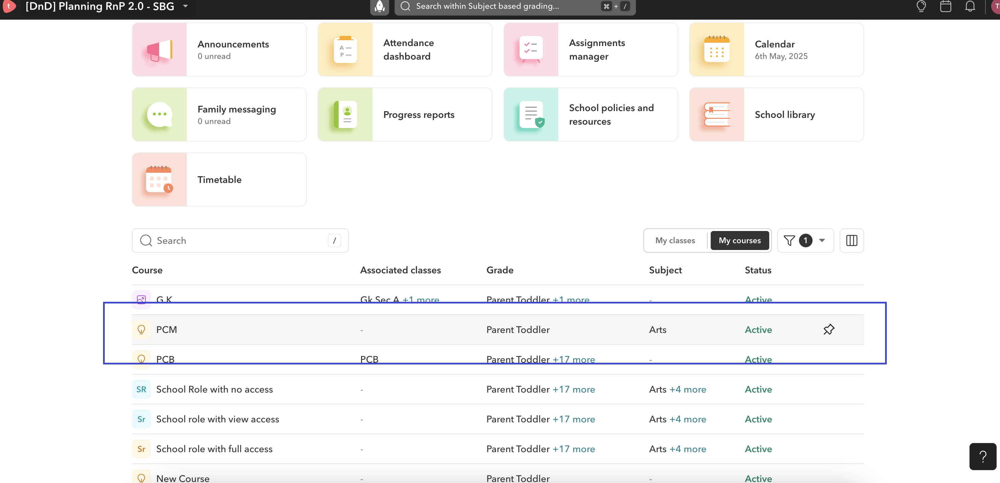
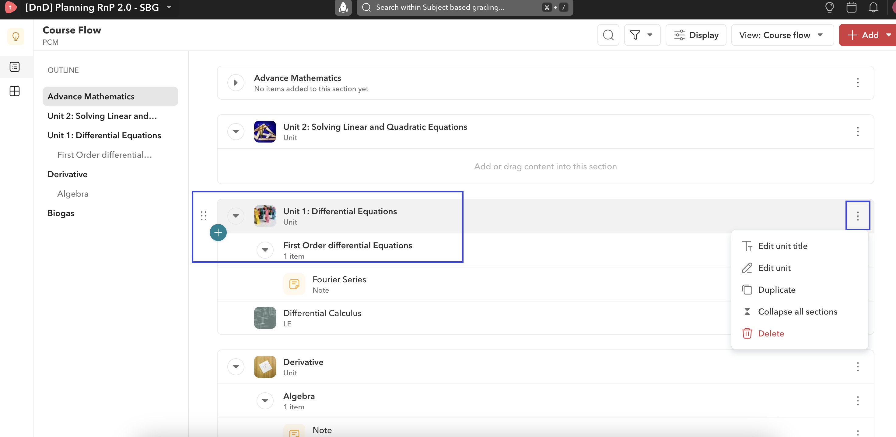
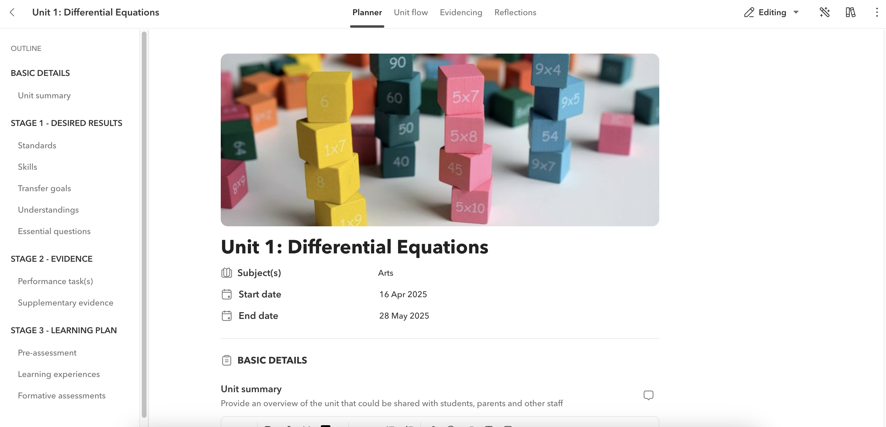
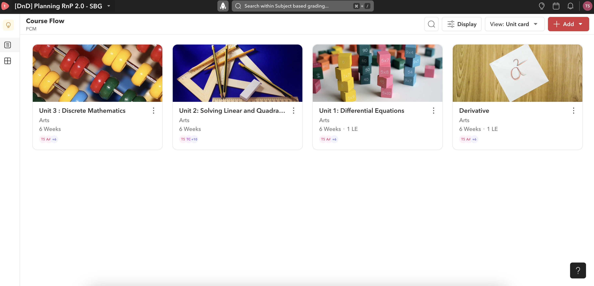
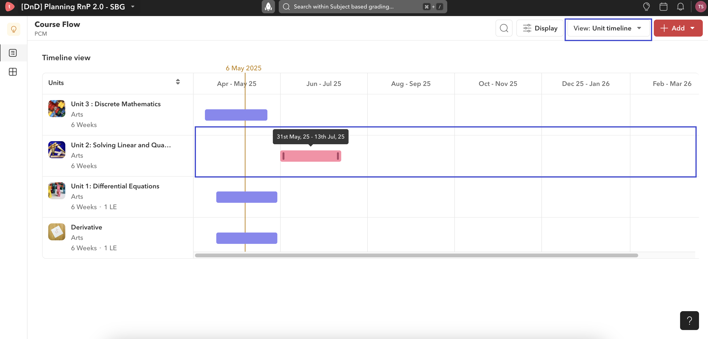
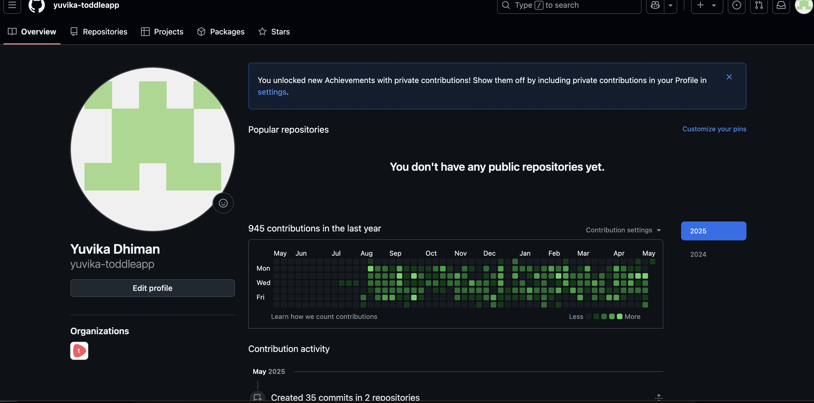

# 🧠Planning System for Educators

The **Planning System for Educators** is a centralized, user-friendly platform designed to streamline lesson planning, class scheduling, collaboration, and resource management for teachers around the world. Built to support diverse curricula such as the International Baccalaureate (IB), it reduces administrative burden and enhances teaching quality by enabling real-time planning, communication, and content sharing in a single system.

---

## ✨ Features

- 🧩 **Unit Planning**: Create and modify curriculum-aligned units using built-in templates  
- 📅 **Class Planner**: Visualize, schedule, and adjust lessons with drag-and-drop simplicity  
- 🔄 **Collaboration Tools**: Share plans, co-edit, and give feedback across teacher networks  
- 📚 **Resource Management**: Organize worksheets, assignments, rubrics, and videos in one place  
- 📊 **Student Tracking**: Monitor performance, grades, and feedback seamlessly  
- 🌐 **Curriculum Support**: Aligned with IB, U.S. Common Core, and U.K. National Curriculum  

---

## 🛠 Tech Stack

- ⚛️ **React** – Frontend library for building dynamic UIs  
- 🎨 **SCSS** – For modular and maintainable styling  
- 🔗 **GraphQL** – Efficient data querying and fetching  
- 🚀 **Apollo Client** – Integrates GraphQL with React for state management and API communication  

---

## 🖼️ Screenshots

### Course Structure Teacher Account Navigation Flow

### Interactive Curriculum Course Builder

### Single Page Unit Planner

### Unit Planning - Card View

### Unit Planning - Timeline View

### Contribution Graph

